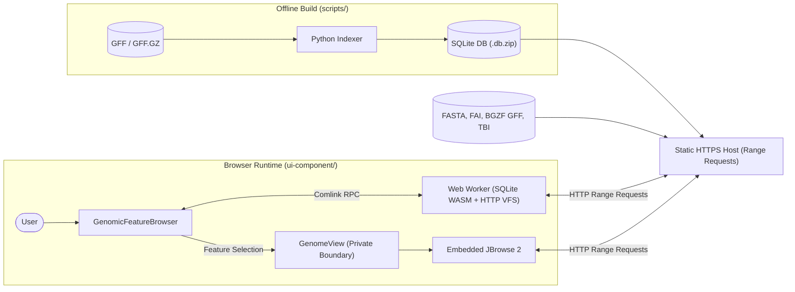

# Google Summer of Code 2026 Final Report

## Project Information

- **Project:** GSoC 2026 Project #14 — A genomic feature database in the browser
- **Organization:** Genome Assembly and Annotation / [EBI-Metagenomics / MGnify](https://github.com/EBI-Metagenomics)
- **Program:** [Google Summer of Code 2026](https://summerofcode.withgoogle.com/)
- **Repository:** [`EBI-Metagenomics/gsoc-genomic-feature-db`](https://github.com/EBI-Metagenomics/gsoc-genomic-feature-db)
- **Contributor:** Muhammad Ali Arif ([@aliarif2050](https://github.com/aliarif2050))
- **Mentors:** Vikas Gupta and Mahfouz Shehu

---

## Project Overview

Modern genomic datasets contain millions of annotated features (genes, CDS, mRNA, functional domains, ontology terms). Traditional exploration requires either hosting heavy database servers (PostgreSQL, Elasticsearch) or requiring users to download massive files locally.

**`gsoc-genomic-feature-db`** establishes a **serverless, local-first genomic search architecture**. It enables bioinformaticians to perform millisecond full-text searches across millions of genomic features and navigate genome visualisations directly in the browser—with zero backend server infrastructure.

The system consists of two primary components:
1. **Offline Indexer ([`scripts/`](scripts/)):** A Python 3 pipeline (standard library only) that parses `.gff` / `.gff.gz` files into a compact, two-table SQLite database with a contentless FTS5 full-text search index.
2. **Browser Search & Genome Browser ([`ui-component/`](ui-component/)):** A React 18 / TypeScript 5 component that queries the SQLite database in a Web Worker using HTTP Range requests (`sqlite-wasm-http`), fetching only queried byte pages on demand, and navigates an embedded JBrowse 2 Linear Genome View.

> For complete usage, installation, and deployment instructions, refer to [`README.md`](README.md) and [`docs/USAGE.md`](docs/USAGE.md).

---

## Goals & Deliverables

- **GFF Ingestion Engine:** Stream and parse standard GFF3/GFF.GZ files without external Python dependencies.
- **Compact SQLite FTS Database:** Design a lightweight schema supporting full-text search across all feature attributes.
- **Client-Side WASM Querying via HTTP Range Requests:** Query static SQLite databases in the browser on demand without full-file downloads.
- **Interactive Search Interface:** Deliver a responsive UI with EMBL Visual Framework (VF 2.5), keyset pagination, and functional annotation popovers.
- **JBrowse Genome View Integration:** Embed JBrowse 2 to visualize sequence tracks and synchronize search result selections with genomic interval highlights.
- **Reusable Component Package & CI:** Package the frontend for reuse (`genomic-feature-db-component`) with automated E2E tests, benchmarks, and CI validation.

---

## Work Completed

### 1. Offline Genomic Feature Indexer (`scripts/`)
- **Parser & Model:** Implemented a streaming GFF3/GFF.GZ parser and typed `GenomicFeature` dataclass ([`scripts/parser.py`](scripts/parser.py), [`scripts/models.py`](scripts/models.py)).
- **Filtering & Deduplication:** Filters low-value unannotated features and avoids duplicate tokens across display and search fields ([`scripts/config.py`](scripts/config.py)).
- **Automated Verification:** 7-check post-build integrity suite validating row counts, rowids, coordinates, strands, version contract, and FTS5 index ([`scripts/database.py`](scripts/database.py), [`scripts/verify_schema.py`](scripts/verify_schema.py)).
- **Delivery Format:** Generates raw SQLite databases with `.db.zip` naming to prevent unwanted HTTP compression on range servers.
- *Details:* See [`scripts/README.md`](scripts/README.md).

### 2. Two-Table SQLite Database Architecture
- **Schema Separation:** Uses `feature_meta` for display data and a contentless `search_fts` virtual table (`content=''`, `detail=none`, `columnsize=0`), reducing file size by **5–6×** (~80% reduction) compared to content FTS5.
- **Tokenization & Versioning:** `unicode61 tokenchars '_.'` for biological IDs; version contract enforced via `database_metadata`.
- *Details:* See [`docs/schema-reference.md`](docs/schema-reference.md) and [`docs/reason_not_using_pure_fts.md`](docs/reason_not_using_pure_fts.md).

### 3. Browser-Side Range-Aware Query Engine (`ui-component/src/workers/`)
- **Guarded HTTP VFS:** Pinned `sqlite-wasm-http` 1.2.0 with preflight validation of `206 Partial Content`, byte ranges, and SQLite magic headers; includes retry and explicit full-download fallback ([`db.worker.ts`](ui-component/src/workers/db.worker.ts), [ADR 0010](docs/decisions/0010-range-aware-sqlite-loading.md)).
- **Query Optimization:** Input sanitizer, multi-token prefix matching (`"dnaA"* "protein"*`), and namespace-qualified prefix optimization (e.g. `GeneID:54998` → `"GeneID" "54998"*`), dropping query times on large datasets from >110 ms to <1 ms ([`fts.ts`](ui-component/src/workers/fts.ts)).
- **Pagination:** Keyset pagination (25 rows/page) by stable `rowid` with 1-row lookahead.
- *Details:* See [`docs/search-quality.md`](docs/search-quality.md).

### 4. Interactive Search & Annotation Interface (`ui-component/src/component/`)
- **EMBL VF 2.5 Styling:** Debounced search form, loading/error states, and active byte counters.
- **Facets & Badges:** Loaded result biological type facets ([`FeatureTypeFacets.tsx`](ui-component/src/component/FeatureTypeFacets.tsx)) and single-letter source badges (`P` Pfam, `I` InterPro, `K` KEGG, `G` GO, `E` EC, etc.) with portal popovers and dynamic legends ([`AnnotationBadges.tsx`](ui-component/src/component/AnnotationBadges.tsx)).
- *Details:* See [`ui-component/src/component/README.md`](ui-component/src/component/README.md).

### 5. Embedded JBrowse Linear Genome View Integration (`ui-component/src/jbrowse/`)
- **Private Domain Boundary:** Encapsulated JBrowse 2 models and MobX state behind `GenomeView` ([`GenomeView.tsx`](ui-component/src/genome-view/GenomeView.tsx), [ADR 0011](docs/decisions/0011-publishable-component-jbrowse-boundary.md)).
- **Navigation & Highlighting:** Coordinate mapping (`1-based` GFF coordinates to zero-based half-open `[start - 1, end)` JBrowse highlights) with single-selection highlight replacement ([`navigation.ts`](ui-component/src/jbrowse/navigation.ts)).
- **Static Streaming:** `IndexedFastaAdapter` (`.fna` + `.fai`) and `Gff3TabixAdapter` (`.gff.gz` + `.tbi`/`.csi`) over HTTP Range requests.
- *Details:* See [`docs/jbrowse-integration.md`](docs/jbrowse-integration.md).

### 6. Component Packaging & Independent Consumer Verification
- **Reusable Package:** Built via Vite library mode as private package `genomic-feature-db-component` with typed declarations (`dist/index.d.ts`), isolated styles, worker bundles, and SQLite WASM binaries.
- **Consumer Fixture:** Dedicated test application ([`examples/package-consumer/`](examples/package-consumer/)) validating clean tarball consumption and E2E journeys.
- *Details:* See [`docs/package-integration.md`](docs/package-integration.md) and [`ui-component/README.md`](ui-component/README.md).

### 7. Performance Benchmarking Suite (`benchmark/`)
- **Multi-Dataset Baseline:** Comprehensive profiling across small (*D. melanogaster*, 17.7 MB DB), medium (*E. coli*, 130 MB DB), and large (*H. sapiens* GRCh38, 1.25 GB DB) datasets.
- **Verification:** Verified indexing throughput, memory RSS, initial load times, search latency, and HTTP byte transfers with zero regressions >20%.
- *Details:* See [`benchmark/final-report-performance.md`](benchmark/final-report-performance.md) and [`benchmark/README.md`](benchmark/README.md).

---

## Final Architecture



> For full architectural details, class diagrams, and sequence interactions, see [`docs/architecture.md`](docs/architecture.md).

---

## Key Technical Decisions

| # | Decision | Alternatives Considered | Rationale |
|---|---|---|---|
| 1 | **Contentless FTS5 (`content=''`)** | Pure Content FTS5 | Stores only the search index, joining to `feature_meta` for display. Saves 5–6× database size (~80% reduction). |
| 2 | **`detail=none` & `columnsize=0`** | `detail=column`; `columnsize=1` | Discards unused column position and BM25 metadata for all-field prefix search, minimizing DB size and Range traffic. |
| 3 | **Two-Table Separation** | Single unified table | Separates display columns (native types) from search index, keeping annotations searchable without bloating display storage. |
| 4 | **HTTP Range Requests (HTTP VFS)** | Full database download | Allows immediate exploration by fetching only the SQLite pages touched by queries on demand. |
| 5 | **Web Worker Execution (Comlink)** | Main-thread SQLite WASM | Offloads synchronous SQLite operations, preventing UI thread blocking. |
| 6 | **Python Standard Library Only** | BioPython / pandas | Zero external dependencies for indexing ensures maximum reproducibility and lightweight CI. |
| 7 | **Private JBrowse Boundary ([ADR 0011](docs/decisions/0011-publishable-component-jbrowse-boundary.md))** | Exposing JBrowse types in public API | Isolates JBrowse/MobX internals from package consumers, keeping the public contract strictly domain-focused. |
| 8 | **Guarded Range Loading ([ADR 0010](docs/decisions/0010-range-aware-sqlite-loading.md))** | Silent full-download fallback | Validates `206` responses and byte headers, providing explicit retry and recovery states if range requests fail. |
| 9 | **Namespace Prefix Optimization** | Naive prefix search | Optimizes colon-delimited queries (`GeneID:54998`), cutting warm query latency from >110 ms to <1 ms. |
| 10 | **Keyset Pagination (`rowid`)** | BM25 relevance sorting | Provides deterministic, bounded pagination without scoring millions of matches across remote byte ranges. |

---

## Testing and Validation

- **Python Tests:** Unit, parser, database, and search quality matrix via `pytest` ([`tests/`](tests/)).
- **Frontend Quality:** Strict TypeScript (`tsc`), ESLint, Prettier, and Vitest component unit tests.
- **Browser E2E Tests:** Playwright suites for Chromium and Firefox covering search, facets, badges, JBrowse navigation, and range delivery recovery ([`ui-component/e2e/`](ui-component/e2e/)).
- **Package Consumer Validation:** Automated script installing the packed tarball into a clean Vite app and running E2E verification ([`test-package.mjs`](ui-component/scripts/test-package.mjs)).
- **CI Pipeline:** GitHub Actions ([`.github/workflows/ci.yml`](.github/workflows/ci.yml)) running Python 3.10/3.12, Node 22, formatting, unit tests, E2E tests, and consumer verification.

> For complete testing instructions and validation matrices, see [`docs/QuickStartGuide/Contributor Guide.md`](docs/QuickStartGuide/Contributor%20Guide.md) and [`docs/command-verification.md`](docs/command-verification.md).

---

## Pull Requests & Development History

### Merged Pull Requests

| PR | Description | Status |
|---|---|---|
| [#2](https://github.com/EBI-Metagenomics/gsoc-genomic-feature-db/pull/2) | **Initial Indexer Implementation & Modularization:** Added standard-library GFF parser, SQLite builder, dataclass models, batch insertion, and verification. | Merged into `main` |
| [#3](https://github.com/EBI-Metagenomics/gsoc-genomic-feature-db/pull/3) | **Indexer PR Review Refinements & Frontend Integration:** Refactored configuration parameters, adjusted database delivery helpers, and updated tests. | Merged into `main` |

### Submitted Work / Pending Merge

The complete frontend application, JBrowse integration, range-loading engine, package build, and benchmarks are fully implemented, tested, and submitted across feature branches:

| PR / Branch | Description | Current Status |
|---|---|---|
| [#4](https://github.com/EBI-Metagenomics/gsoc-genomic-feature-db/pull/4) (`add-ui-component`) | **Genomic Feature Search UI & JBrowse Integration:** Complete React UI, Web Worker SQLite engine, JBrowse 2 linear genome view, feature facets, and annotation popovers. | Implementation completed and submitted; PR approved and pending merge |
| [#15](https://github.com/EBI-Metagenomics/gsoc-genomic-feature-db/pull/15) (`issues-9-12-search-quality`) | **Search Quality & Range Hardening (Issues 6, 7, 9, 10 & 12):** Namespace-qualified search query optimization, guarded SQLite range loading with retry/fallback (ADR 0010), E2E test suite, and CI automation. | Implementation completed and submitted; PR approved and pending merge |
| [#17](https://github.com/EBI-Metagenomics/gsoc-genomic-feature-db/pull/17) (`issue-14-performance-baseline`) | **Performance Baseline & Benchmarking Harness (Issue 14):** Multi-dataset profiling harness, browser performance metrics, and baseline performance report. | Implementation completed and submitted; PR under review |
| [#18](https://github.com/EBI-Metagenomics/gsoc-genomic-feature-db/pull/18) (`feature/component-package`) | **Reusable Package Extraction & Final Optimization (Issue 13):** Reusable package packaging (`genomic-feature-db-component`), consumer verification fixture, `detail=none`/`columnsize=0` FTS5 optimization, and final benchmark verification. | Implementation completed and submitted; PR under review |

---

## Changes From the Original Plan

1. **Unified All-Field Search:** Replaced the planned column-dropdown filter with a unified all-field prefix search, improving researcher ergonomics.
2. **Two-Table Contentless Architecture:** Transitioned from a single FTS table to a contentless FTS5 virtual table joined with `feature_meta`, achieving an 80% database size reduction.
3. **`detail=none` & `columnsize=0`:** Switched to minimal FTS5 configuration to optimize database size and byte-range transfers.
4. **Private GenomeView Boundary ([ADR 0011](docs/decisions/0011-publishable-component-jbrowse-boundary.md)):** Encapsulated JBrowse behind a clean domain boundary instead of exposing visualizer internals.
5. **Guarded HTTP Range VFS ([ADR 0010](docs/decisions/0010-range-aware-sqlite-loading.md)):** Added strict header verification and explicit error recovery states to prevent silent full downloads on misconfigured servers.

---

## Current Limitations & Future Work

- **Public Registry Publishing:** Package is currently tested and distributed via local tarballs; automated npm registry publishing remains a maintainer decision.
- **Advanced Search Modifiers:** Phrase queries, fuzzy matching, and boolean syntax were intentionally omitted to bound remote range requests; these can be evaluated if researcher needs arise.
- **Reference Name Aliasing:** Navigation requires exact matching between GFF `seqid` and FASTA reference names.
- **Production EMBL-EBI Pipeline Integration:** Linking the component directly to live EMBL-EBI genome APIs and automated publication jobs once production endpoints are finalized.

> For an in-depth breakdown of architectural boundaries and future roadmaps, see [`docs/limitations-and-future-work.md`](docs/limitations-and-future-work.md) and [`docs/production-data-integration.md`](docs/production-data-integration.md).

---

## How to Run & Evaluate

```bash
# 1. Generate SQLite database from a GFF file
python scripts/indexer.py sample_data/MGYG000490722/MGYG000490722.gff.gz

# 2. Run the frontend demo
cd ui-component
npm ci
npm run dev # Open http://localhost:5173/

# 3. Build reusable package and run consumer validation
npm run build:lib
npm run pack:local
npm run test:package

# 4. Run test suites
pytest tests/ -v
npm run typecheck && npm test
npm run test:e2e -- --project=chromium
```

> For step-by-step setup guides, consult [`README.md`](README.md) and [`docs/USAGE.md`](docs/USAGE.md).

---

## Documentation Index

| Document | Description |
|---|---|
| [`README.md`](README.md) | Primary project overview, getting started, and tech stack. |
| [`docs/architecture.md`](docs/architecture.md) | Architectural specification, component boundaries, and sequence diagrams. |
| [`docs/schema-reference.md`](docs/schema-reference.md) | Database schema specification and FTS5 configuration rationale. |
| [`docs/USAGE.md`](docs/USAGE.md) | User guide for running the demo and configuring datasets. |
| [`docs/QuickStartGuide/Contributor Guide.md`](docs/QuickStartGuide/Contributor%20Guide.md) | Contributor guidelines, development setup, and PR validation. |
| [`docs/package-integration.md`](docs/package-integration.md) | Integration guide for consuming `genomic-feature-db-component`. |
| [`docs/production-data-integration.md`](docs/production-data-integration.md) | EMBL-EBI production deployment, HTTPS Range contracts, and CORS headers. |
| [`docs/search-quality.md`](docs/search-quality.md) | Search semantics, tokenization rules, and quality matrix. |
| [`docs/decisions/0010-range-aware-sqlite-loading.md`](docs/decisions/0010-range-aware-sqlite-loading.md) | ADR 0010: Guarded HTTP range loading and recovery modes. |
| [`docs/decisions/0011-publishable-component-jbrowse-boundary.md`](docs/decisions/0011-publishable-component-jbrowse-boundary.md) | ADR 0011: Private JBrowse component boundary. |
| [`benchmark/final-report-performance.md`](benchmark/final-report-performance.md) | Performance benchmark comparison across small, medium, and large datasets. |
| [`docs/limitations-and-future-work.md`](docs/limitations-and-future-work.md) | Known limitations and future work roadmap. |

---

## Conclusion & Acknowledgements

The **`gsoc-genomic-feature-db`** project demonstrates that large-scale genomic feature search and genome visualization can be performed **entirely in the browser** without dedicated backend servers. Combining standard-library Python indexing, contentless SQLite FTS5 database tuning, guarded HTTP Range querying in Web Workers, and an encapsulated JBrowse 2 Linear Genome View yields a high-speed, local-first search experience on static hosting.

I would like to sincerely thank my mentors, **Vikas Gupta** and **Mahfouz Shehu**, and the **[EBI-Metagenomics / MGnify](https://github.com/EBI-Metagenomics)** team at EMBL-EBI for their continuous guidance, support, and domain feedback throughout Google Summer of Code 2026.
