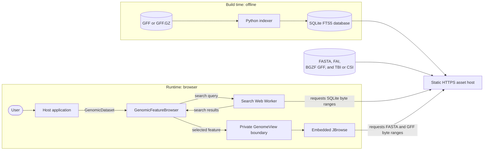

# gsoc-genomic-feature-db

**GSoC 2026 Project #14 — A genomic feature database in the browser**

> A serverless, local-first search interface that lets bioinformaticians query millions of genomic features directly in the browser, backed by a compact SQLite FTS5 database served via HTTP Range requests.

---

## What This Project Is

The system has two halves:

| Half                                       | Language                  | Purpose                                                                                                                                                     |
| ------------------------------------------ | ------------------------- | ----------------------------------------------------------------------------------------------------------------------------------------------------------- |
| **Backend indexer** (`scripts/`)           | Python 3 (stdlib only)    | Parse `.gff` / `.gff.gz` genomic annotation files → build a compact, optimised SQLite database with FTS5 full-text search                                   |
| **Frontend and package** (`ui-component/`) | TypeScript / React / Vite | Search an accession-specific SQLite database and navigate an embedded JBrowse linear genome view, either as the repository demo or a reusable local package |

There is **no application server at runtime**. SQLite, FASTA, FAI, BGZF GFF, and
TBI/CSI assets are served as static files. SQLite querying happens client-side in
a Web Worker, while JBrowse reads the reference and annotations through byte-range
requests.

**Primary users:** Bioinformaticians and genomics researchers who need fast, interactive exploration of genomic annotations (gene names, biotypes, GO terms, Pfam domains, etc.).

**Deployment target:** Any static host that preserves raw genomic bytes, supports
HTTP ranges, and supplies appropriate CORS headers.

---

## Architecture Overview



### Key Runtime Flow

This is a deliberately small data-flow overview. In the current React implementation,
`GenomicFeatureBrowser` owns the search state and selection; `App.tsx` is only the
repository demo host. JBrowse is reached through the private `GenomeView` boundary.
See the maintained [architecture guide](docs/architecture.md) for component, class,
and sequence diagrams.

1. The host passes one `GenomicDataset` containing exact asset URLs.
2. `useDbSearch` boots a URL-scoped Web Worker and opens `{accession}.db.zip`
   through SQLite HTTP VFS.
3. The embedded view opens immediately at the dataset's small initial region
   with reference and annotation tracks active. The indexed adapters request
   only the FASTA/GFF ranges needed for that region.
4. User input of at least three characters executes an FTS5 prefix search and
   returns keyset-paginated results.
5. A feature selection navigates the existing view state to the feature's
   flanked location and requests any additional indexed data ranges needed
   there. Every selection replaces the native JBrowse highlight with the
   feature's exact interval while reusing the same tracks and view state.
6. Changing accession disposes the old worker, results, selection, and JBrowse
   view before activating the next dataset.

### JBrowse selection highlights

- Reference names use identity mapping: an indexed feature's `seqid` is passed
  directly to JBrowse as its `refName`. Each dataset's GFF and FASTA files must
  therefore use matching sequence names; if no matching reference exists,
  navigation displays an accessible error message.
- Search results store one-based inclusive GFF coordinates. Navigation location
  strings remain one-based, while the exact native JBrowse highlight converts
  `[start, end]` to the zero-based half-open interval `[start - 1, end)`.
- `setHighlight([highlight])` keeps one active selection, so choosing another
  result replaces the previous highlight instead of accumulating bands.
- The highlight intentionally has no explicit color. This lets JBrowse apply its
  theme-aware translucent color; an opaque color would obscure the full track
  area because native JBrowse interval highlights are full-height bands.
- The band marks a genomic interval; it does not select or recolor an individual
  rendered GFF feature glyph.

---

## Database Design (Versioned Two-Table Search Architecture)

### `feature_meta` — regular SQLite table (display data)

| Column               | Type       | Purpose                                                                  |
| -------------------- | ---------- | ------------------------------------------------------------------------ |
| `rowid`              | INTEGER PK | Shared rowid for JOIN                                                    |
| `feature_id`         | TEXT       | Source feature identifier; SQLite `rowid` is the internal identity       |
| `name`               | TEXT       | Gene/feature name                                                        |
| `feature_type`       | TEXT       | Biological type (gene, mRNA, CDS, exon…)                                 |
| `seqid`              | TEXT       | Chromosome / contig                                                      |
| `start`              | INTEGER    | 1-based start coordinate                                                 |
| `end`                | INTEGER    | 1-based end coordinate                                                   |
| `strand`             | TEXT       | `+`, `-`, `.`, or `?`                                                    |
| `biotype`            | TEXT       | Classification (protein_coding, lncRNA…)                                 |
| `description`        | TEXT       | Product / description text                                               |
| `functional_summary` | TEXT       | Per-tag annotation values for UI display (≤ 50 values/tag, ≤ 2000 chars) |

### `search_fts` — contentless FTS5 virtual table (search index)

| Column        | Indexed | Purpose                                                                                                          |
| ------------- | ------- | ---------------------------------------------------------------------------------------------------------------- |
| `feature_id`  | ✅      | Identifier search                                                                                                |
| `name`        | ✅      | Gene name search                                                                                                 |
| `biotype`     | ✅      | Biological classification search                                                                                |
| `description` | ✅      | Keyword search in descriptions                                                                                   |
| `annotations` | ✅      | Full functional annotations (GO, Pfam, KEGG…), ≤ 50 values/tag — **searchable but never stored as display text** |

### `database_metadata` — schema compatibility

Every generated database contains exactly one `database_metadata` row with a
numeric schema version and an indexer generator version. The browser validates
this row before querying feature data and rejects incompatible artifacts with a
clear initialization error. See [the schema reference](docs/schema-reference.md)
for the complete data contract and rebuild-based compatibility policy.

### FTS5 Configuration Rationale

| Setting      | Value                       | Why                                                                                               |
| ------------ | --------------------------- | ------------------------------------------------------------------------------------------------- |
| `content`    | `''` (contentless)          | Display data lives in `feature_meta` — no need to store text twice. Saves ~40-50% DB size.        |
| `detail`     | `none`                      | Current UI uses all-field prefix search, so column and position metadata are unnecessary.          |
| `columnsize` | `0`                         | BM25 document-length statistics are unused because results use deterministic rowid ordering.       |
| `tokenize`   | `unicode61 tokenchars '_.'` | Keeps identifiers like `BU_ATCC8492` and `NC_012345.1` as single tokens.                          |

### Why Contentless + Two Tables?

- **5–6× smaller** than pure FTS5 with zero loss in search accuracy.
- `annotations` is indexed for search but never stored as FTS text. `functional_summary` is stored separately for UI badges and popovers; both retain up to 50 values and 2,000 characters per configured tag, while the search field omits values duplicated in identity/display fields.
- The pipeline is **write-once** (rebuild from GFF files), so DELETE/UPDATE limitations of contentless FTS are irrelevant.

---

## Directory Map

```
gsoc-genomic-feature-db/
├── scripts/                          # Python backend indexer
│   ├── indexer.py                     # CLI entry point
│   ├── parser.py                      # GFF file parser
│   ├── database.py                    # SQLite builder, repo, verifier
│   ├── models.py                      # GenomicFeature dataclass
│   ├── config.py                      # Constants and PRAGMAs
│   ├── utils.py                       # Logger, helpers
│   ├── verify_schema.py               # Standalone DB verification
│   └── README.md                      # Indexer documentation
│
├── ui-component/                      # React/Vite frontend
│   ├── src/
│   │   ├── config.ts                  # Central constants (single source of truth)
│   │   ├── App.tsx                    # Demo registry and accession selector
│   │   ├── main.tsx                   # React entry point
│   │   ├── index.css                  # Global layout
│   │   ├── cvf-genomic-search.css     # Search / badge / popover / table styles
│   │   ├── types.ts                    # Dataset and component types
│   │   ├── library.ts                  # Public package entry point
│   │   │
│   │   ├── genome-view/
│   │   │   └── GenomeView.tsx         # Private boundary around JBrowse
│   │   │
│   │   ├── hooks/
│   │   │   └── useDbSearch.ts         # Worker lifecycle + search state
│   │   │
│   │   ├── jbrowse/
│   │   │   ├── GenomicLinearView.tsx
│   │   │   ├── config.ts              # Pure assembly and track builders
│   │   │   └── navigation.ts          # GFF-to-JBrowse coordinates
│   │   │
│   │   ├── workers/
│   │   │   ├── db.worker.ts           # SQLite WASM + HTTP VFS (Comlink)
│   │   │   └── fts.ts                 # Pure FTS5 MATCH-expression builder
│   │   │
│   │   └── component/
│   │       ├── GenomicFeatureBrowser.tsx
│   │       ├── SearchBar.tsx          # Orchestrator (state + debounce)
│   │       ├── SearchForm.tsx         # VF all-fields input + search button
│   │       ├── FeatureTypeFacets.tsx  # Counts by type in loaded results
│   │       ├── ResultsTable.tsx       # Sticky-header results table
│   │       ├── AnnotationBadges.tsx   # Badge components + popover + legend
│   │       ├── README.md               # Frontend component documentation
│   │       └── annotations/
│   │           ├── sources.ts         # Annotation source catalogue (data)
│   │           └── parse.ts           # functional_summary parser
│   ├── scripts/                         # Package build, inspection, and test orchestration
│   ├── index.html                      # React shell + VF/EBI CDN assets
│   ├── package.json
│   ├── vite.config.ts
│   ├── vite.lib.config.ts              # Reusable library build configuration
│   ├── tsconfig.json
│   └── tsconfig.app.json
│
├── examples/
│   └── package-consumer/               # Independent Vite/React tarball consumer
│       ├── e2e/                        # Packed-package browser test
│       ├── package.json
│       └── README.md                   # Purpose and manual test instructions
│
├── sample_data/                       # Local demo/test fixture; not production data
│   └── MGYG000490722/
│       ├── MGYG000490722.db.zip
│       ├── MGYG000490722.fna
│       ├── MGYG000490722.fna.fai
│       ├── MGYG000490722.gff.gz
│       └── MGYG000490722.gff.gz.tbi
│
├── tests/                             # Python test suite (pytest)
│   ├── conftest.py                    # Fixtures (builds test DB from sample GFF)
│   ├── test_database.py               # Database builder + verifier tests
│   ├── test_indexer.py                # End-to-end indexer tests
│   ├── test_parser.py                 # GFF parser tests
│   └── test_search_quality.py         # Fixed demo-database search matrix
│
├── docs/                              # Design documentation
│   ├── README.md                       # Documentation index
│   ├── schema-reference.md            # Full schema + FTS5 config docs
│   ├── reason_not_using_pure_fts.md   # Why contentless FTS5
│   ├── advanced_column_search.md      # FTS configuration history
│   ├── search-quality.md              # Search semantics, quality, and targets
│   └── plan.md                        # GSoC timeline + WBS
│
├── .github/workflows/ci.yml           # GitHub Actions CI
├── .pre-commit-config.yaml            # Black + Ruff hooks
└── README.md
```

---

## Getting Started

### Prerequisites

- Python 3.10+ (no external packages needed for the indexer)
- Node.js 22.x / npm

### 1. Generate the Database

```bash
python scripts/indexer.py \
  sample_data/MGYG000490722/MGYG000490722.gff.gz
```

This creates `sample_data/MGYG000490722/MGYG000490722.db.zip`. The filename is an
HTTP delivery convention that discourages automatic HTTP compression; the file
contains raw SQLite bytes and is not a ZIP archive.

**CLI options:** `--prefix` (pre-index 3/4-char prefixes), `--no-vacuum`, `--limit N`.

### 2. Run the Frontend

```bash
cd ui-component
npm ci
npm run dev
# Open http://localhost:5173/
```

The demo registry initially contains only `MGYG000490722`. Every registry entry
must provide its own complete five-file runtime bundle. `sample_data/` is a
local fixture and is excluded from normal production builds.

The bundled demo and its browser-testing workflow are described in
[the User Guide](docs/USAGE.md). For a fresh clone, use `npm ci` so the frontend
dependencies match the committed lockfile, then install the Playwright browsers
before running E2E tests:

```powershell
cd ui-component
npx playwright install chromium firefox
```

The production data boundary, recommended EBI publication flow, range/CORS
contract, and remaining EBI endpoint decisions are documented in
[Production data integration](docs/production-data-integration.md).

The bundled demo and its browser-testing workflow are described in
[the User Guide](docs/USAGE.md). For a fresh clone, use `npm ci` so the frontend
dependencies match the committed lockfile, then install the Playwright browsers
before running E2E tests:

```powershell
cd ui-component
npx playwright install chromium firefox
```

The bundled demo and its browser-testing workflow are described in
[the User Guide](docs/USAGE.md). For a fresh clone, use `npm ci` so the frontend
dependencies match the committed lockfile, then install the Playwright browsers
before running E2E tests:

```powershell
cd ui-component
npx playwright install chromium firefox
```

### 3. Run Python Tests

```bash
pip install pytest
pytest tests/ -v
```

### 4. Run Frontend Validation

```bash
cd ui-component
npm run typecheck
npm run lint
npm run format:check
npm test
npm run build
npm run test:e2e -- --project=chromium
npm run test:e2e -- --project=firefox
npm run test:e2e
```

Chromium-based browsers and Firefox are the supported/tested browsers. CI runs
the Chromium critical workflow; run Firefox locally before a release or after
browser-sensitive UI changes. WebKit and the optional performance checks are
local validation rather than merge gates. See [the User Guide](docs/USAGE.md)
for the complete test scope, including the intentionally ignored external-CDN
console errors in the E2E test.

---

## Frontend Component Tree

```
App.tsx
└── GenomicFeatureBrowser
    ├── useDbSearch.ts
    │   └── db.worker.ts
    │       └── fts.ts
    ├── SearchBar.tsx
    │   ├── SearchForm.tsx
    │   ├── FeatureTypeFacets.tsx
    │   ├── ResultsTable.tsx
    │   └── AnnotationBadges.tsx
    └── GenomicLinearView.tsx
        ├── IndexedFastaAdapter
        └── Gff3TabixAdapter
```

### Search Query Pipeline (Browser-Side)

1. **Gate:** require ≥ 3 characters before touching the DB.
2. **Sanitise:** preserve usable letters, numbers, `_`, `.`, and identifier separators, then safely quote FTS terms.
3. **Prefix match:** ordinary tokens become quoted prefix terms joined as implicit AND: `"dnaA"* "protein"*`. Namespaced IDs such as `GeneID:54998` and `HGNC:HGNC:1729` keep their namespace structure while prefix matching the final value.
4. **All fields:** production searches the complete FTS index; there is no field dropdown.
5. **Pagination:** results use stable `rowid` ordering and 25-row keyset pages; a one-row lookahead determines whether **Load More** is shown.
6. **Counts:** the UI reports rows loaded and whether more are available; it does not run a global FTS count over HTTP VFS.

See [Search Semantics, Quality, and Performance](docs/search-quality.md) for the
fixed MGYG quality matrix, ranking decision, performance target, and known
limitations.

### Feature-Type Facet

`FeatureTypeFacets.tsx` groups the rows currently loaded in the browser by
`feature_type`, sorts them by count and name, and labels missing types as
`Unspecified`. The counts grow when **Load More** appends results. This is currently
a display-only facet: it explains the loaded result set but does not filter the
query and does not represent totals across every database match.

### Annotation Display

`functional_summary` renders as compact, colour-coded **single-letter source badges** (`P` Pfam, `I` InterPro, `K` KEGG, `G` GO, `E` EC, `N` eggNOG, `C` COG, `X` DbXref, `…` Other) — fixed-width regardless of annotation count. Clicking a badge opens a popover listing every value for that source.

> **CSS class convention:** custom classes use hyphens (`cvf-annotation-legend`, `cvf-annotation-popover`, …), not dots. An earlier escaped-dot form (`cvf\.foo`) broke styling — `className="cvf\.foo"` produces the literal class `cvf\foo`, which never matches the CSS selector `.cvf\.foo`.

---

## Key Design Decisions

| #   | Decision                                        | Alternatives Considered          | Rationale                                                                                                                                |
| --- | ----------------------------------------------- | -------------------------------- | ---------------------------------------------------------------------------------------------------------------------------------------- |
| 1   | **Contentless FTS5**                            | Content FTS5 (stores text twice) | Browser downloads the DB — every MB matters. Saves ~40-50% size.                                                                         |
| 2   | **`detail=none`, `columnsize=0` in the current DB** | `detail=column`, `detail=full`; `columnsize=1` | Current UI uses all-field prefix search and stable rowid paging, so FTS column detail and BM25 size metadata are unnecessary. |
| 3   | **Two-table design**                            | Single FTS5 table                | Separate display (native types, `functional_summary`) from search (FTS only).                                                            |
| 4   | **HTTP VFS (Range requests)**                   | Download entire DB upfront       | On-demand page fetching — only query-touched pages are fetched.                                                                          |
| 5   | **Web Worker + Comlink**                        | Main-thread SQLite               | SQLite ops are synchronous; Comlink provides typed RPC without blocking UI.                                                              |
| 6   | **Python stdlib only**                          | pandas, BioPython                | Zero external dependencies = easier onboarding, reproducibility, CI.                                                                     |
| 7   | **`annotations` vs `functional_summary` split** | Single field for both            | `annotations` for search (full, deduplicated); `functional_summary` for display (compact). Both cap at ≤ 50 values/tag (≤ 2000 chars).   |
| 8   | **Prefix matching** over phrase search          | FTS5 phrase queries              | Multi-word queries split into individual prefix terms — more forgiving for genomic search.                                               |
| 9   | **Loaded-result feature-type facet**            | A second aggregate DB query      | Gives immediate context without additional HTTP-VFS work. Its scope is deliberately labelled as the rows loaded so far.                  |
| 10  | **Stable rowid ordering**                       | BM25 relevance sorting           | Avoids scoring and sorting every broad match over HTTP VFS; fixed tests verify deterministic pages.                                      |

---

## Backend Indexer Pipeline

### Modules

| File                                           | Role                                                                                                                                           |
| ---------------------------------------------- | ---------------------------------------------------------------------------------------------------------------------------------------------- |
| [`indexer.py`](scripts/indexer.py)             | CLI entry point. Coordinates parsing → insertion → verification → optimisation.                                                                |
| [`parser.py`](scripts/parser.py)               | `GFFParser` class. Reads `.gff`/`.gff.gz`, parses attributes, builds annotations, filters low-value features.                                  |
| [`database.py`](scripts/database.py)           | `DatabaseBuilder` (schema + PRAGMAs), `FeatureRepository` (batch insert + optimise), `DatabaseVerifier` (7-check integrity suite).             |
| [`models.py`](scripts/models.py)               | `GenomicFeature` dataclass with typed fields and tuple conversion.                                                                             |
| [`config.py`](scripts/config.py)               | All constants: `BATCH_SIZE`, `LOW_VALUE_TYPES`, `FUNCTIONAL_TAGS`, `DESCRIPTION_KEYS`, `NAME_KEYS`, `ID_KEYS`, `BIOTYPE_KEYS`, SQLite PRAGMAs. |
| [`utils.py`](scripts/utils.py)                 | Logger factory, DB size helper.                                                                                                                |
| [`verify_schema.py`](scripts/verify_schema.py) | Standalone verification script for manual DB inspection.                                                                                       |

### Key Behaviours

- **No external dependencies** — Python standard library only.
- **Low-value filtering:** Features of types like `exon`, `region`, `chromosome` are skipped unless they carry real annotations.
- **Deduplication:** Annotation values already present in `name`, `description`, or `biotype` are excluded from the `annotations` field.
- **Post-build verification:** 7 automated integrity checks (row count sync, rowid sync, NULL IDs, valid coordinates, valid strands, FTS5 integrity-check).
- **Batch insertion:** Default 150,000 rows per batch for performance.

---

## Tech Stack

| Technology                | Version | Purpose                                                      |
| ------------------------- | ------- | ------------------------------------------------------------ |
| React                     | 18.3    | UI framework                                                 |
| Vite                      | 5.4     | Dev server + bundler                                         |
| TypeScript                | 5.5     | Type safety                                                  |
| EMBL VF CDN               | 2.5.28  | Global layout, form, button, table, badge, and error styling |
| Custom CSS                | -       | Component-specific styling (`cvf-*`)                         |
| `@sqlite.org/sqlite-wasm` | 3.51    | SQLite compiled to WASM                                      |
| `sqlite-wasm-http`        | 1.2     | HTTP VFS — fetch DB pages via Range requests                 |
| Comlink                   | 4.4     | Typed RPC between main thread and Web Worker                 |
| Python (stdlib)           | 3.10+   | Backend indexer (sqlite3, gzip, argparse, dataclasses)       |

---

## Development Workflow

### Code Quality

**Python** — Black formatting + Ruff linting:

```bash
# Install pre-commit hooks (once)
pre-commit install

# Format and lint
black .
ruff check --fix .

# Run all pre-commit hooks
pre-commit run --all-files
```

**TypeScript** — Strict mode, ES module workers:

```bash
cd ui-component
npm install
npm run build     # tsc -b && vite build
```

### Static hosting requirements

- Serve `.db.zip`, `.fna`, `.fna.fai`, `.gff.gz`, and `.gff.gz.tbi`/`.csi`
  with byte-range support. Large database, FASTA, and BGZF GFF files are read
  on demand; their small indexes may be fetched in full by the client.
- Serve `.gff.gz` as raw BGZF bytes without HTTP gzip transformation.
- Configure CORS when assets and the application use different origins.
- Load Visual Framework globally in the host; do not restyle JBrowse or Material
  UI internals from component CSS.

The default `npm run build` is the reusable package build and excludes
`sample_data/`. Use `npm run build:demo` only for a self-contained
demonstration; production should supply approved EBI HTTPS asset URLs through
`GenomicDataset`.

---

## Contributing

See the [Quick Start / Contributor Guide](<docs/QuickStartGuide/Contributor Guide.md>)
for the setup, validation matrix, demo-data boundary, and pull-request workflow.

---

## GSoC Timeline

| Date            | Milestone                 |
| --------------- | ------------------------- |
| May 25, 2026    | Project Work Period Start |
| Jul 6–10, 2026  | Midterm Evaluation        |
| Aug 17–24, 2026 | Final Submission          |
| Aug 24–31, 2026 | Final Evaluation          |
| Nov 9, 2026     | Project Completion Date   |

---

## License

This project is part of [GSoC 2026](https://summerofcode.withgoogle.com/) with [EBI-Metagenomics](https://github.com/EBI-Metagenomics).
