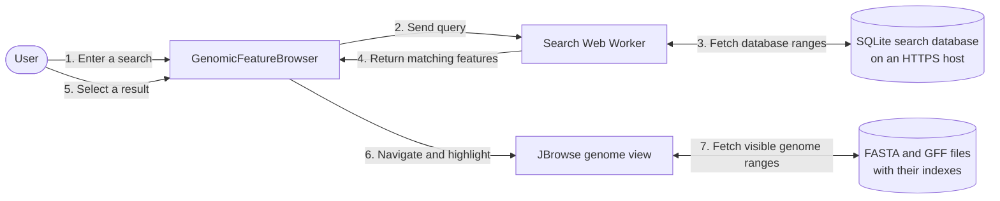
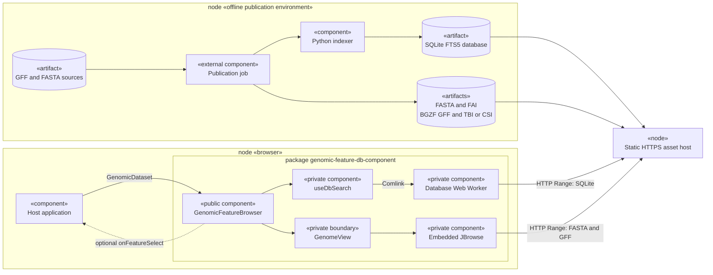
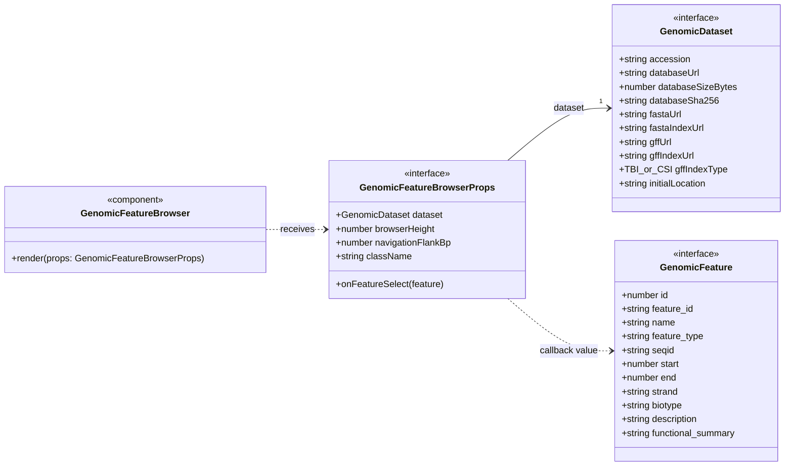
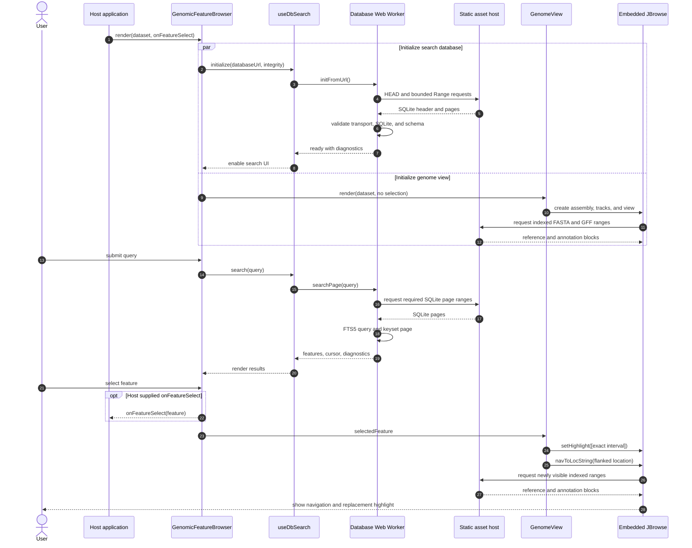

# Project architecture

The project builds a compact genomic feature search database offline and queries it
directly in the browser. The frontend combines that local SQLite search with an
embedded JBrowse linear genome view and can run either as the repository demo or as a
private npm tarball installed into another Vite/React application.

## Architecture at a glance

This simplified view shows what happens when someone searches for and selects a
genomic feature:



The browser downloads only the required byte ranges. Search queries run locally in
the Web Worker, while JBrowse independently reads the reference and annotation
files. No application search server is required.

## System boundaries

This UML component view separates offline publication, static hosting, the consuming
application, and the package's private implementation:



There is no application search server at runtime. The host publishes static genomic
assets and supplies their URLs; SQLite queries run inside the browser Web Worker.

## Offline indexer

The Python modules under `scripts/`:

1. stream `.gff` or `.gff.gz` input;
2. normalize useful identity, display, and annotation fields;
3. skip configured low-value unannotated features;
4. store display rows in `feature_meta`;
5. store searchable text in the contentless `search_fts` FTS5 table;
6. write `database_metadata` with schema and generator versions;
7. optimize and verify the completed SQLite database; and
8. publish it using the historical `.db.zip` delivery suffix.

The output contains raw SQLite bytes, not a ZIP archive. See the
[schema reference](schema-reference.md) for the authoritative database contract.

## Browser search runtime

`GenomicFeatureBrowser` starts `useDbSearch` for the active database URL. The hook
owns an ES module Web Worker exposed through Comlink. The worker:

- validates range behavior, remote size, SQLite header, and schema compatibility;
- opens SQLite WASM through `sqlite-wasm-http`;
- converts user input into a safe all-fields prefix query;
- joins FTS matches to display metadata;
- returns deterministic 25-row keyset pages; and
- exposes explicit retry and complete-download recovery state.

Normal operation fetches bounded database byte ranges. It never silently changes to
a complete download after range validation fails.

## Component composition

The public component renders:

```text
GenomicFeatureBrowser
  |-- DatabaseStatus
  |-- GenomeView (private domain boundary)
  |     `-- GenomicLinearView (JBrowse implementation)
  `-- SearchBar
        |-- SearchForm
        |-- FeatureTypeFacets
        |-- AnnotationLegend / AnnotationPopover
        `-- ResultsTable + Load More
```

The public package boundary contains one runtime value, `GenomicFeatureBrowser`, and
the `GenomicDataset`, `GenomicFeature`, and `GenomicFeatureBrowserProps` types. Search
hooks, worker APIs, JBrowse models, `GenomeView`, a search-only component, and
external-JBrowse integration remain private.

The public types form this UML class diagram:



Optional TypeScript properties are shown without `?` because Mermaid interprets that
character as a visibility marker. `GenomicFeatureBrowser` is the only public runtime
value; the other three boxes are public TypeScript interfaces.

React and React DOM are peer dependencies. JBrowse, MobX, Comlink, SQLite WASM, and
the HTTP VFS are package runtime dependencies.

## JBrowse boundary and selection

`GenomeView` receives only project-domain data: the dataset, selected feature,
height, and navigation flank. JBrowse imports, model state, assembly/track builders,
coordinate conversion, and highlighting stay behind that boundary.

Selecting a result:

1. updates the component's selected `GenomicFeature`;
2. calls the optional host `onFeatureSelect` callback;
3. navigates the existing JBrowse view to a flanked one-based location; and
4. replaces its highlight with the zero-based half-open interval
   `[start - 1, end)`.

The complete runtime interaction is shown in this UML sequence diagram:



Changing `accession` or `databaseUrl` recreates the composed instance, disposing old
search and view state. Ordinary selections reuse the existing JBrowse model.

## Dataset and hosting contract

Each `GenomicDataset` identifies one internally consistent assembly:

| Asset                  | Runtime consumer           |
| ---------------------- | -------------------------- |
| Raw SQLite `.db.zip`   | SQLite HTTP VFS worker     |
| FASTA `.fna`           | JBrowse reference adapter  |
| FASTA index `.fna.fai` | JBrowse reference adapter  |
| BGZF GFF `.gff.gz`     | JBrowse annotation adapter |
| TBI or CSI index       | JBrowse annotation adapter |

SQLite `seqid`, FASTA reference names, and GFF sequence names must match exactly.
The static host must preserve raw bytes, support HTTP Range requests, and expose
range and validator headers through CORS when origins differ.

## Demo and package builds

The frontend has separate entry and asset boundaries:

- `npm run dev` runs the source demo and serves the local sample fixture through
  development-only Range middleware.
- `npm run build:demo` builds the repository demo and intentionally copies sample
  data.
- `npm run build` and `npm run build:lib` create the reusable ESM package output,
  declarations, scoped CSS, worker graph, and WASM.
- `npm run pack:local` creates and inspects the ignored local tarball.
- `npm run test:package` installs that tarball into the independent
  `examples/package-consumer` application and exercises development and production
  preview.

The package uses an explicit `files` allow-list, so demo source, sample data, tests,
benchmarks, and consumer files are not shipped.

## Styling ownership

Package CSS is limited to project-owned `cvf-` component selectors. Demo layout and
global `body`/`#root` rules live outside the package stylesheet. The host application
owns Visual Framework globals, page layout, and surrounding navigation.

## Verification layers

- Python tests cover parsing, schema, indexing, and search behavior.
- Vitest covers search helpers, transport guards, pagination, components, and
  JBrowse configuration/navigation.
- Repository Playwright tests cover the demo, five-file Range delivery, recovery,
  runtime assets, search, pagination, and JBrowse behavior.
- Package-consumer Playwright tests observe the installed worker and WASM and repeat
  the critical search-to-highlight journey in development and production.
- Browser performance benchmarks are opt-in and remain separate from normal
  regression tests.

See the [user guide](USAGE.md), [package integration](package-integration.md), and
[production data integration](production-data-integration.md) for operational
commands and deployment details.
